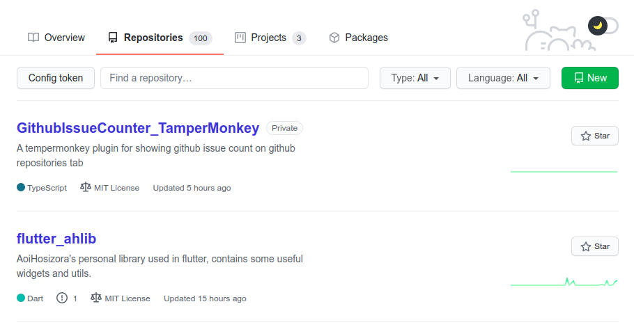

# GithubIssueCounter_TamperMonkey

+ A tampermonkey plugin for showing github issue count on github repositories tab.

### Debug

```bash
npm run build # npm run watch
python -m http.server 5000
# Visit http://localhost:5000/dist/github-issue-counter.user.js
```

### Install

+ Install TamperMonkey / GreaseMonkey plugin in your browser.
+ Visit https://github.com/Aoi-hosizora/GithubIssueCounter_TamperMonkey/raw/master/dist/github-issue-counter.user.js and install.

### Attention

+ See https://docs.github.com/en/free-pro-team@latest/rest/reference/rate-limit and https://docs.github.com/en/free-pro-team@latest/rest/overview/resources-in-the-rest-api#rate-limiting for details of rate limit. So please config your access token if necessary.

> **For API requests using Basic Authentication or OAuth, you can make up to 5,000 requests per hour**. Authenticated requests are associated with the authenticated user, regardless of whether Basic Authentication or an OAuth token was used. This means that all OAuth applications authorized by a user share the same quota of 5,000 requests per hour when they authenticate with different tokens owned by the same user.
>
> For users that belong to a GitHub Enterprise Cloud account, requests made using an OAuth token to resources owned by the same GitHub Enterprise Cloud account have an increased limit of 15,000 requests per hour.
> 
> **For unauthenticated requests, the rate limit allows for up to 60 requests per hour**. Unauthenticated requests are associated with the originating IP address, and not the user making requests.

### Screenshots



### References

+ [How to detect if URL has changed after hash in JavaScript](https://stackoverflow.com/questions/6390341/how-to-detect-if-url-has-changed-after-hash-in-javascript)
